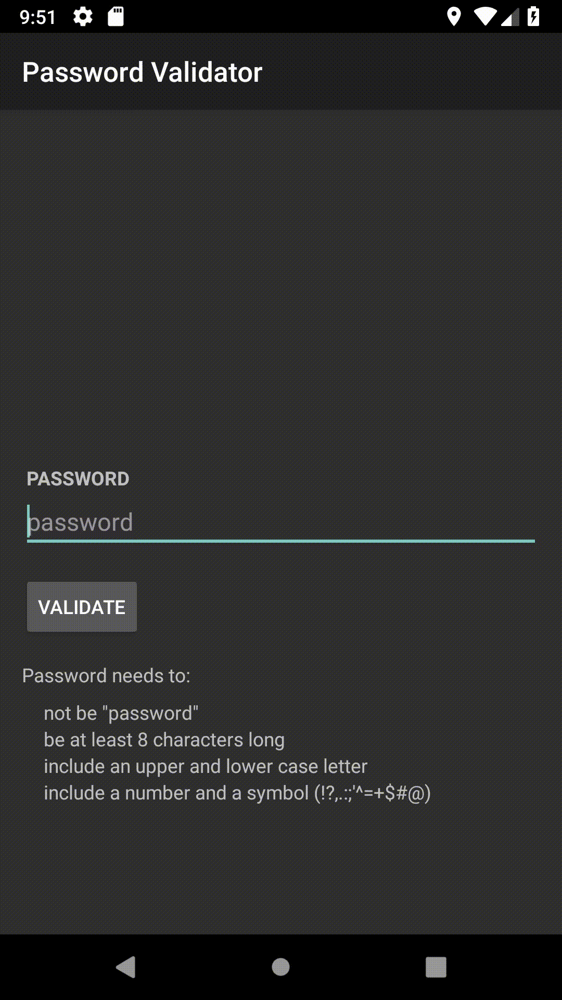

# Assignment 2: Test-Driven Development (JUnit)

This is Assignment 2 for CSCI 3130 Summer 2018. 

## a2-stage1 Branch

A class called Validator.java, with a single method called validate.

The method validate() validates a given (string) password with a set of rules, and returns the number of rules the string passed.

Rules implemented:
* not "password"
* is at least 8 characters

## a2-stage2 Branch

Same as above, however 3 more rules of my choosing were added.

Rules implemented:
* includes a symbol (!?,.:;"'^=+$#@)
* includes an upper and lower case letter
* includes a number

## a2-stage3 Branch

Same as above, but added a UI where you can enter a password, hit the *VALIDATE* button, and it will tell you if the password is strong enough or not based on the rules.

(Information pulled from assignment2.pdf from Brightspace)
